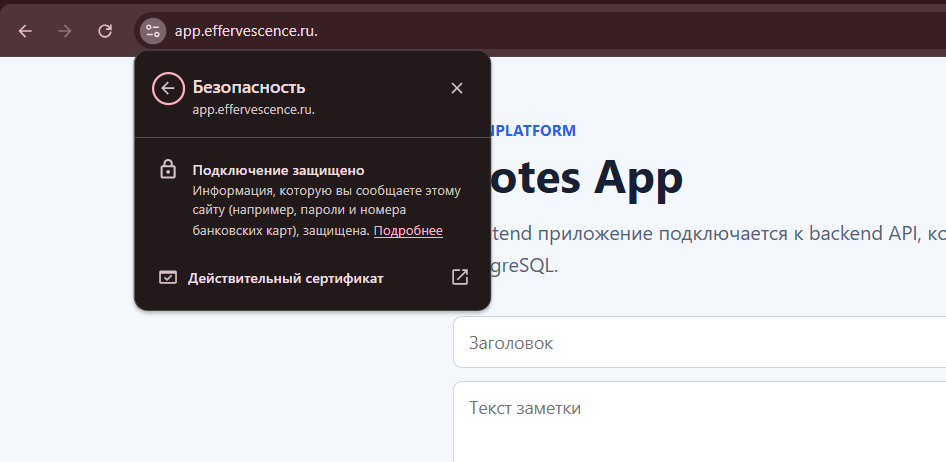
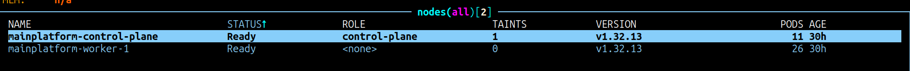
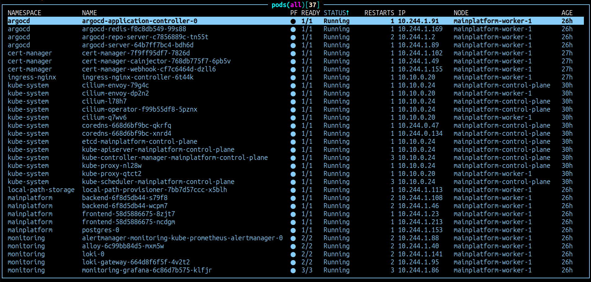
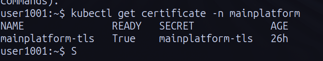
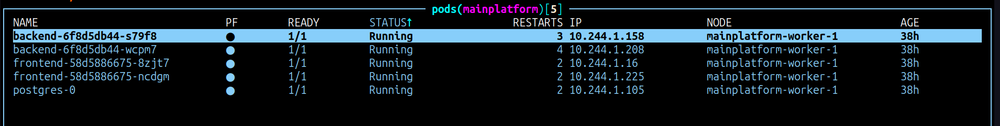

# Kubernetes

**`Стек: Kubernetes · kubeadm · containerd · Cilium · ingress-nginx · cert-manager · Let's Encrypt · Argo CD · Ansible · Tailscale · Ubuntu`**

> *Рабочее приложение на `app.effervescence.ru`*

**Kubernetes** кластер разворачивается при помощи Terraform, который создаёт 2 ноды (1 под control-plane, 1 под worker) на Ubuntu 24.04, а также настраивает сетевые политики на Yandex.Cloud и Ansible который полностью настраивает эти 2 ноды после запуска.

Абсолютно весь **Kubernetes** настраивает Ansible, так как эти 2 ноды это всё место где требуется администрирование с моей стороны, остальное, а именно container registry, хостинг git-репозиториев и CI/CD платформа предоставляет GitHub.

> Порядок установки Kubernetes через Ansible состоит из:
1. [Установка Tailscale](ansible/roles/tailscale_subnet_router/) на control-plane ноду, так чтобы она маршрутизировала приватную подсеть, которую Yandex.Cloud определяет для серверов.
2. [Установка kubeadm](ansible/roles/kubeadm_cluster/) на control-plane и worker ноды. Подключение воркер ноды к мастер ноде.
3. [Установка аддонов](ansible/roles/cluster_addons/), а именно: helm → ingress-nginx → cert-manager → storage → monitoring → argocd.
4. [Настройка Argo CD](ansible/roles/gitops_bootstrap/), в этот же момент происходит синхронизация всех [Kubernetes манифестов](manifests/).

*При повторном запуске не происходит изменений, если они не требуются*

### Финальный результат установки Kubernetes через Ansible
> 
2 ноды живы и связаны.

> 
Все нужные поды запущены и работают

> 
Сертификат готов и работает

> 
Argo CD применил манифесты

**kubeadm** и **containerd** использованы в первоначальной настройке кластера, так как являются стандартом, которого мне хватало вполне. **Cilium** был выбран так как является продвинутым вариантом, он быстрее и также даёт встроенную визуализацию сетевого трафика между подами.

Весь внешний трафик заходит через **ingress-nginx**, он маршрутизирует запросы к сервисам по домену и пути, описанным в [kube-prometheus-stack-values.yaml](ansible/roles/cluster_addons/files/kube-prometheus-stack-values.yaml) для Grafana, в [argocd-values.yaml](ansible/roles/cluster_addons/files/argocd-values.yaml) для Argo CD и [ingress.yaml](manifests/ingress.yaml) для приложения. TLS-сертификаты выпускаются через **cert-manager**, который автоматически запрашивает их у **Let's Encrypt**. ([cluster-issuer.yaml](ansible/roles/cluster_addons/files/cluster-issuer.yaml))

### Что можно поменять/добавить

* Первым делом необходимо добавить бэкапы, для состояния Kubernetes кластера, а также для PostgreSQL. В данный момент их нет.
* Отличным вариантом является перенос PostgreSQL в облако, а именно в Managed PostgreSQL, а весь Kubernetes в Managed Kubernetes. Из минусов этого варианта это более высокая стоимость такого варианта, из плюсов меньше администрирования.
* Для меньшей зависимости от облака можно заменить Ubuntu на Talos, Fedora CoreOS (или ей подобные ОС), это ускорит развёртывание worker и control-plane нод, за счёт этого можно будет отказаться от Ansible, как минимум от ролей для установки Tailscale и самого Kubernetes.

****
*Полный код проекта:* [github.com/1001-Night/petProject-mainPlatform](https://github.com/1001-Night/petProject-mainPlatform)
*В нём ссылки на описания других аспектов проекта: CI/CD, Observability и IaC, а также описание того как самостоятельно воспроизвести всю инфраструктуру с нуля*